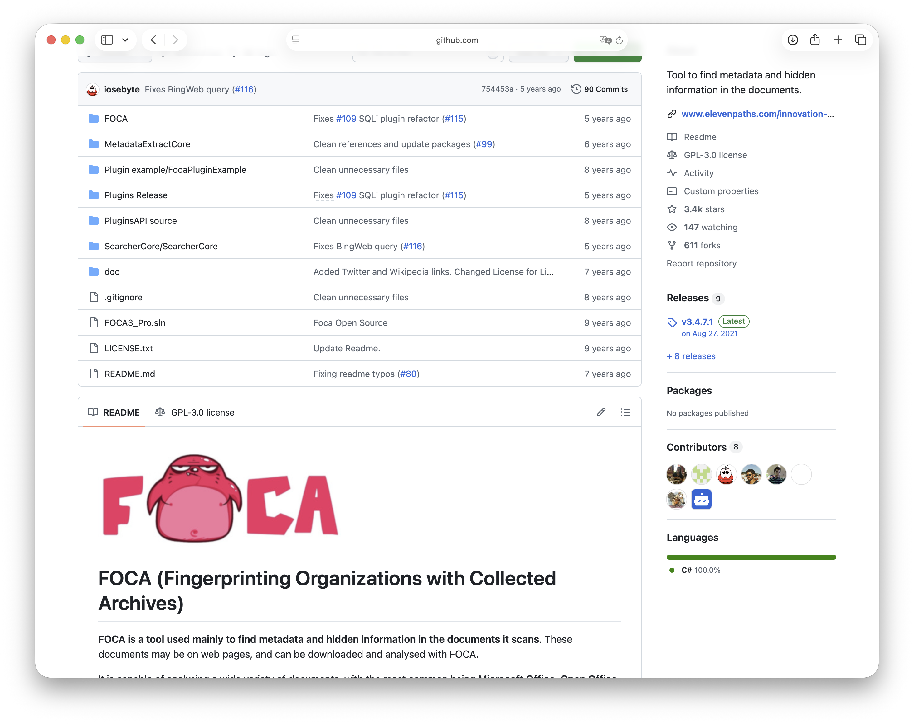
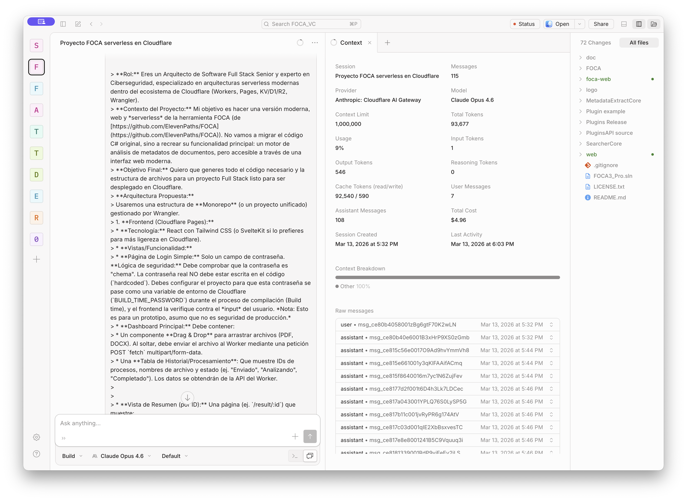
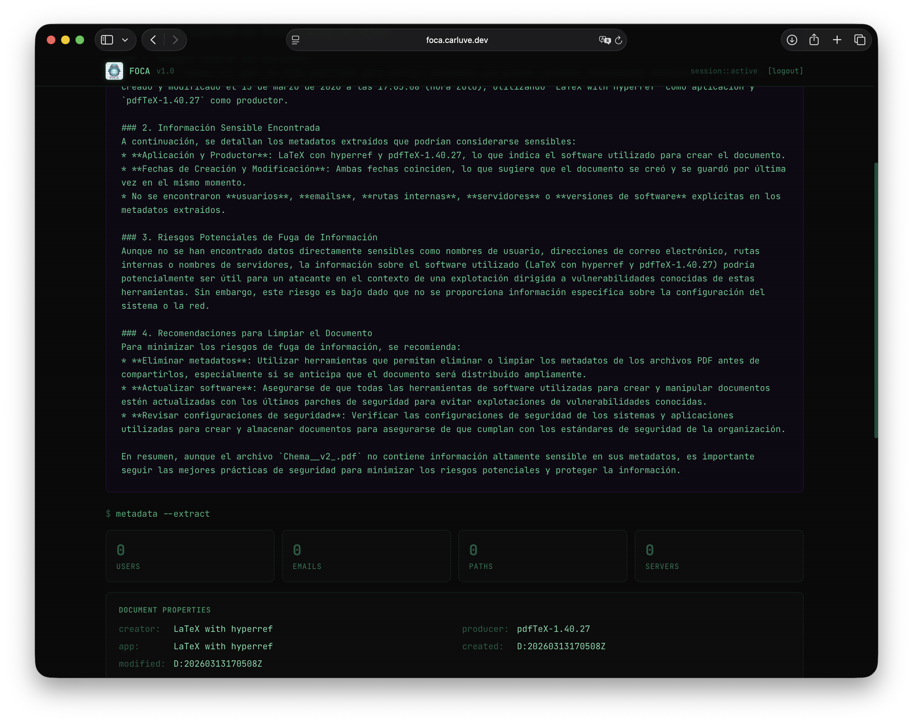
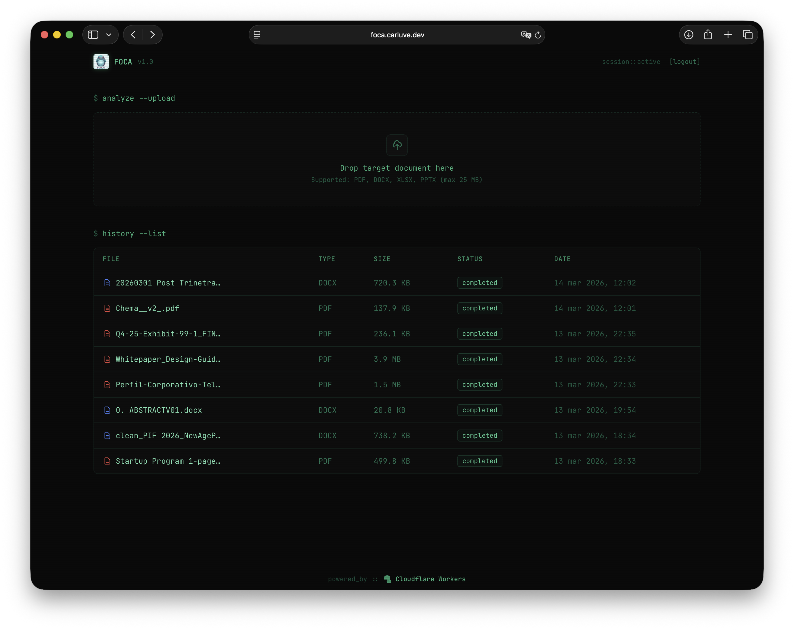

# De C# y Windows a TypeScript y Cloudflare Workers: Resucitando FOCA con OpenCode

Si la semana pasada [migramos el Arkanoid de C++ a TypeScript](https://www.elladodelmal.com/2026/03/como-migrar-arkanoid-de-c-typescript.html) con **OpenCode** y lo desplegamos en Cloudflare Workers en una tarde, esta semana teníamos que subir el listón. Y nada mejor para hacerlo que coger una herramienta que muchos de vosotros conocéis de sobra: **FOCA**.

Sí, **FOCA (Fingerprinting Organizations with Collected Archives)**, la herramienta de análisis de metadatos que creó el equipo de ElevenPaths y que lleva años siendo referencia en el mundo del OSINT y el pentesting. La aplicación de escritorio para Windows escrita en C# que muchos habéis usado para encontrar usuarios, rutas internas, servidores e información sensible escondida en los metadatos de los documentos corporativos.

El reto esta vez era más ambicioso que el Arkanoid: no solo migrar el código, sino **modernizar la solución completa**: interfaz web, backend serverless, base de datos en la nube, almacenamiento de ficheros, protección anti-bots, análisis con IA y despliegue continuo. Todo en Cloudflare. Todo sin servidores. Y con **OpenCode** llevando el peso técnico.

---

## El prompt inicial

Todo empieza con un prompt. Aquí está el que le dimos a OpenCode para arrancar el proyecto desde cero:

> **Rol:** Eres un Arquitecto de Software Full Stack Senior y experto en Ciberseguridad, especializado en arquitecturas serverless modernas dentro del ecosistema de Cloudflare (Workers, Pages, KV/D1/R2, Wrangler).
>
> **Contexto del Proyecto:** Mi objetivo es hacer una versión moderna, web y serverless de la herramienta FOCA (de https://github.com/ElevenPaths/FOCA). No vamos a migrar el código C# original, sino a recrear su funcionalidad principal: un motor de análisis de metadatos de documentos, pero accesible a través de una interfaz web moderna.
>
> **Objetivo Final:** Quiero que generes todo el código necesario y la estructura de archivos para un proyecto Full Stack listo para ser desplegado en Cloudflare.
>
> **Arquitectura Propuesta:**
> Usaremos una estructura de Monorepo (un proyecto unificado) gestionado por Wrangler.
>
> 1. **Frontend (Cloudflare Pages):** React con Tailwind CSS
>    - Página de Login Simple: Solo un campo de contraseña. La lógica de seguridad: Debe comprobar que la contraseña es "chema". La contraseña real NO debe estar escrita en el código. Debes configurar el proyecto para que esta contraseña se pase como una variable de entorno de Cloudflare durante el proceso de compilación, y el frontend la verifique contra el input del usuario.
>    - Dashboard Principal: Drag & Drop para arrastrar archivos (PDF, DOCX). Al soltar, debe enviar el archivo al Worker mediante una petición POST multipart/form-data.
>    - Tabla de Historial/Procesamiento: Que muestre IDs de procesos, nombres de archivo y estado.
>    - Vista de Resumen (por ID): Una página que muestre los metadatos extraídos de forma visual.
>
> 2. **Backend (Cloudflare Worker con Hono):** API REST
>    - POST /api/analyze: Recibe el archivo, lo guarda en R2, lanza la extracción de metadatos y guarda el resultado en D1.
>    - GET /api/history: Devuelve la lista de análisis de D1.
>    - GET /api/result/:id: Devuelve los metadatos completos de un análisis.
>
> 3. **Extracción de Metadatos:**
>    - Para PDF: Extraer Author, Title, Creator, Producer, CreationDate, ModDate del diccionario /Info.
>    - Para DOCX: Descomprimir el ZIP, leer docProps/core.xml y docProps/app.xml.
>
> **Reglas estrictas:**
> - Usa TypeScript en todo el proyecto
> - Toda la lógica de extracción debe funcionar en el runtime de Workers (sin Node.js, sin fs, sin librerías nativas)
> - Genera el schema SQL para D1
> - Genera el wrangler.toml completo con todos los bindings

Ese prompt de unas 400 palabras fue suficiente para que OpenCode generara la estructura completa del proyecto: carpetas, ficheros, schema SQL, wrangler.toml, todos los componentes React y todas las rutas del Worker. A partir de ahí, la conversación fue de refinamiento: añadir funcionalidades, pulir la UI, solucionar problemas de tipos en TypeScript e ir integrando las piezas nuevas.

---

## El origen: FOCA en GitHub, 3.400 estrellas y 100% C#

Empecemos por el principio. El repositorio original de FOCA en GitHub tiene 3.400 estrellas, 611 forks y está escrito en **C# al 100%**. Es una aplicación de escritorio con Windows Forms, dependencias de .NET y una arquitectura que en su momento fue muy sólida, pero que hoy exige que el usuario tenga una máquina Windows con el entorno instalado para poder ejecutarla.

El repositorio tiene el código organizado en varios proyectos: el motor de extracción de metadatos (*MetadataExtractCore*), los buscadores y crawlers, los plugins y la interfaz de usuario. Una arquitectura de hace diez años, con todas las dependencias que eso implica.

La pregunta era: ¿se puede recrear la funcionalidad principal de FOCA —extracción de metadatos de documentos— en una aplicación web moderna, serverless, accesible desde cualquier dispositivo y desplegada en la red de Cloudflare? La respuesta, spoiler, es que sí. Y además con cosas que la FOCA original no tenía, como **análisis de seguridad generado por IA**.

---

## De Windows Forms y C# a React y Cloudflare Workers: lo que no es solo "reescribir"

Hay una diferencia fundamental entre "migrar código" y "migrar una arquitectura". El Arkanoid era un juego: un bucle de física, colisiones y render. FOCA es una herramienta de seguridad con dependencias profundas del sistema operativo, APIs de Windows y librerías .NET que no tienen equivalente directo en el mundo web.

Estos fueron los retos reales de la migración:

### Windows Forms → React SPA

La interfaz original de FOCA es una aplicación de escritorio con paneles, tablas, menús y diálogos de Windows. Todo eso hubo que repensar como una Single Page Application con React: drag & drop para subir ficheros (usando `react-dropzone`), tablas de historial, vistas de resultado con los metadatos estructurados y un sistema de navegación con React Router. No es solo cambiar el lenguaje; es cambiar el paradigma completo de interacción.

### `System.IO.File` y `MemoryStream` → `ArrayBuffer` y Web APIs

En C#, leer un fichero es trivial: `File.ReadAllBytes()`, `new MemoryStream(bytes)`, listo. En el runtime de Cloudflare Workers no existe `fs`, no existe `path`, no existe el sistema de ficheros del sistema operativo. Todo fichero llega como un `ArrayBuffer` de la petición HTTP y hay que procesarlo en memoria usando las APIs estándar del navegador: `TextDecoder`, `Uint8Array`, `DataView`. El cambio mental es significativo.

### `ZipArchive` de .NET → JSZip

Los formatos DOCX, XLSX y PPTX son ZIPs con XMLs dentro. En .NET hay `System.IO.Compression.ZipArchive` que funciona con streams del sistema de ficheros. En Workers, la librería **JSZip** hace el trabajo equivalente pero operando completamente en memoria sobre `ArrayBuffer`. La lógica de extracción de `docProps/core.xml` y `docProps/app.xml` es similar; la plomería que la rodea es completamente distinta.

### Librerías de extracción PDF nativas → parsing binario manual

Aquí fue donde más se notó la diferencia. FOCA original usa librerías .NET que se comunican con el sistema operativo para procesar PDFs. En Workers, librerías como `pdf-parse` no funcionan porque dependen de `fs` de Node. La solución fue implementar un extractor propio: leer el PDF como `ArrayBuffer`, decodificarlo en `latin1` para preservar los bytes binarios, y usar expresiones regulares para localizar el diccionario `/Info` y extraer los campos `(Author)`, `(Creator)`, `(Producer)`... Funciona para la gran mayoría de PDFs modernos.

### Estado en base de datos local → D1 (SQLite en el edge)

FOCA original guarda sus proyectos en ficheros locales o en SQL Server local. En la versión cloud, cada análisis se persiste en **D1**, la base de datos SQLite distribuida de Cloudflare. Las migraciones se versionan en ficheros `.sql` y se aplican con `wrangler d1 migrations apply`. El schema es limpio: una tabla `analyses` con el estado, los metadatos en JSON y el resumen de IA, y una tabla `processing_logs` para el timeline de cada análisis.

### Almacenamiento local → R2

Los ficheros originales se guardan en **R2**, el almacenamiento de objetos de Cloudflare compatible con S3. Esto permite servir el fichero limpio de metadatos directamente desde el Worker como descarga, sin mover bytes por ningún servidor intermedio.

---

## La sesión de OpenCode: 115 mensajes, $4,96 y un proyecto completo

Antes de ver el resultado, hay que hablar del proceso. Porque esta vez no fue una sesión de una hora. Fue una sesión de trabajo real, con OpenCode como copiloto técnico, gestionando decisiones de arquitectura, escribiendo código, detectando errores de tipos en TypeScript y desplegando en Cloudflare.

Si os fijáis en los números de la sesión: **115 mensajes**, proveedor **Anthropic vía Cloudflare AI Gateway**, modelo **Claude Opus 4.6**, 93.677 tokens totales, coste total **$4,96**. Por menos de cinco dólares, OpenCode escribió toda la arquitectura del proyecto, todos los componentes frontend, todas las rutas del backend, las migraciones de base de datos, los extractores de metadatos para PDF y Office, la integración con Workers AI, el widget de Turnstile y el README completo.

Y lo más interesante del screenshot: fijaos en que el propio OpenCode está usando **Cloudflare AI Gateway** para enrutar sus llamadas a Claude. Es decir, la herramienta que estamos usando para construir sobre Cloudflare está ella misma corriendo sobre Cloudflare. Inception nivel empresarial.

---

## La arquitectura: todo Cloudflare, un solo despliegue

La FOCA Web que hemos construido usa el stack completo de Cloudflare, todo montado como un único Worker con **Wrangler v4**:

El frontend React/Vite se compila a estáticos y se sirve directamente desde la CDN de Cloudflare a través del binding `env.ASSETS`. El backend Hono intercepta solo las rutas `/api/*` antes de que el runtime intente servir un asset. Un único `wrangler deploy` sube todo: los estáticos, el Worker y los bindings. Nada de proyectos Pages separados, nada de Functions en carpetas especiales.

Los bindings activos:

- **Workers** — Backend completo con Hono. Rutas: `/api/analyze`, `/api/history`, `/api/result/:id`, `/api/download-clean/:id`, `/api/summarize/:id`, `/api/turnstile/verify`.
- **D1** — SQLite en el edge. Tablas: `analyses` (con columna `ai_summary` para el resumen persistido) y `processing_logs`.
- **R2** — Ficheros originales en `originals/{id}/{filename}`.
- **Workers AI** — Inferencia con `@cf/meta/llama-3.3-70b-instruct-fp8-fast` vía AI Gateway `foca-v1`.
- **Turnstile** — Secret key como Worker Secret, nunca en el código.

---

## Lo que no fue trivial: los extractores de metadatos sin Node.js

Aquí está el reto técnico real de la migración. El runtime de Cloudflare Workers **no es Node.js**. Es V8 puro, con las APIs de Web Platform pero sin acceso al sistema de ficheros, sin `fs`, sin la mayoría de los módulos de Node. Esto descarta de golpe herramientas como `exiftool`, `pdf-parse` en su versión completa o cualquier librería que dependa del sistema operativo.

La solución para los **documentos Office** (DOCX, XLSX, PPTX) fue elegante: estos formatos son ZIPs por dentro. Usando **JSZip**, que funciona perfectamente en Workers, se descomprime el fichero, se leen los XMLs de propiedades (`docProps/core.xml`, `docProps/app.xml`) y se extraen los campos: autor, empresa, último editor, fechas, rutas de template...

Para los **PDFs** el enfoque fue diferente. Los metadatos en un PDF están en el diccionario `/Info` del documento, embebidos como texto en el binario. OpenCode implementó un extractor que lee el fichero como `ArrayBuffer`, lo decodifica en `latin1` (para preservar los bytes binarios) y usa expresiones regulares para extraer los campos del diccionario: `/Author (valor)`, `/Creator (valor)`, `/Producer (valor)`, etc.

El mismo approach se usa para la limpieza: se reemplazan los valores por cadenas vacías en el binario, se parchea también el bloque XMP si existe, y se recodifica de vuelta a `Uint8Array`. Sin librerías externas, sin Node, puro JavaScript en el edge.

---

## El resumen de IA que se persiste solo

Una de las funciones más interesantes es el análisis de seguridad generado por IA. Cuando el usuario pulsa *"ai_summary"* en la pantalla de resultados, el Worker llama a Workers AI con el modelo Llama 3.3 70B y un prompt que describe los metadatos extraídos: usuarios encontrados, emails, rutas internas, software usado, sistema operativo...

El modelo responde en español con un análisis estructurado: qué información sensible se ha encontrado, qué riesgos implica y qué recomendaciones hay para limpiar el documento antes de compartirlo. Pero lo interesante es lo que pasa después: el resumen se **guarda en D1** en una columna `ai_summary`. La próxima vez que alguien abra ese análisis, el resumen aparece directamente, sin llamar a la IA de nuevo. Caché persistente con cero infraestructura adicional.

En la imagen podéis ver un análisis real de un PDF. El modelo ha identificado que el documento fue creado con **LaTeX con hyperref** y producido con **pdfTeX-1.40.27**, ha analizado las fechas de creación y modificación, y ha concluido que aunque no hay información altamente sensible, el software usado podría ser relevante para un atacante que quisiera explotar vulnerabilidades conocidas de esa versión. Todo en español, bien estructurado, con recomendaciones concretas.

---

## La interfaz: terminal hacker verde porque sí

Y aquí viene la parte que más me gusta del proyecto. Cuando le dijimos a OpenCode que queríamos una interfaz "retro hacker verde pero que se vea moderna", el resultado fue exactamente lo que teníamos en mente: fondo negro `#0a0a0a`, texto en verde esmeralda, fuente **JetBrains Mono**, efecto CRT de scanlines con CSS puro, comandos de terminal como títulos de sección (`$ analyze --upload`, `$ history --list`), y la barra de título con los tres puntos rojo/amarillo/verde.

En el dashboard podéis ver el historial real de análisis. PDFs de todo tipo: un whitepaper de diseño de 3,9 MB, un perfil corporativo de 1,5 MB, DOCX de propuestas... y en la barra inferior el footer que no podía faltar: *"powered_by :: ☁ Cloudflare Workers"*.

El login tiene el widget de **Cloudflare Turnstile** integrado para protección anti-bots. La contraseña se hashea en el navegador con SHA-256 usando la Web Crypto API antes de compararse, así el hash va en el build pero la contraseña real nunca aparece en el bundle. Y la secret key de Turnstile vive como secreto del Worker, nunca en el código.

---

## El resultado: Fear the FOCA, ahora en el cloud

En resumen, lo que hemos construido en esta sesión:

- ✅ Extracción de metadatos de PDF, DOCX, XLSX y PPTX en el edge, sin Node.js
- ✅ Descarga del fichero limpio de metadatos (PDF rewriting + ZIP patching)
- ✅ Análisis de seguridad con IA (Llama 3.3 70B) persistido en D1
- ✅ Historial completo de análisis con logs de procesamiento
- ✅ Protección anti-bots con Cloudflare Turnstile
- ✅ Interfaz retro hacker verde con JetBrains Mono y efecto CRT
- ✅ Despliegue completo en Cloudflare Workers con un solo comando
- ✅ Coste de infraestructura: prácticamente cero (Workers Free tier)

El repo está en [github.com/Carluve/FOCA_VC](https://github.com/Carluve/FOCA_VC) y la aplicación live en [foca.carluve.dev](https://foca.carluve.dev).

La próxima vez que alguien os diga que las herramientas de ciberseguridad clásicas están muertas, mostrarles esto. FOCA sigue aquí, ahora corriendo en 330 ubicaciones alrededor del mundo, con IA integrada y sin necesidad de instalar nada. El lado del mal también se moderniza.

**Saludos,
Carlos Luengo**
*Sr. Account Executive en Cloudflare*
